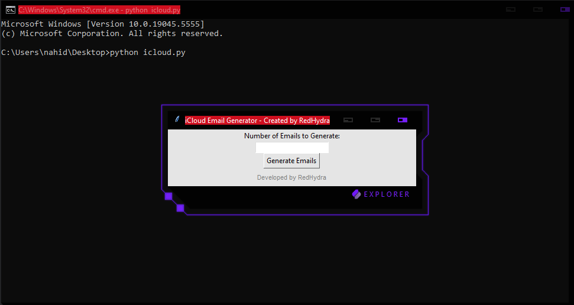

# 🔐 iCloud Email Generator & Validator


A Python utility for generating and validating iCloud email addresses with GUI support.



## ✨ Features
- **Realistic Generation**  
  🎲 Create iCloud emails using authentic name patterns
- **Multi-Layer Validation**  
  ✅ Syntax check + MX record verification + DNS validation
- **Smart Logging**  
  📁 Auto-save valid emails to `result.txt` with timestamps
- **User-Friendly GUI**  
  🖥️ Tkinter-based interface with intuitive controls
- **Custom Configuration**  
  ⚙️ YAML config support for advanced users
- **Error Resilient**  
  🔄 Automatic retries for failed validations

## 🛠️ Installation
```bash
# Clone repository
git clone https://github.com/yourusername/icloud-email-generator.git
cd icloud-email-generator

# Install dependencies
pip install -r requirements.txt

# Linux users may need:
sudo apt-get install python3-tk
